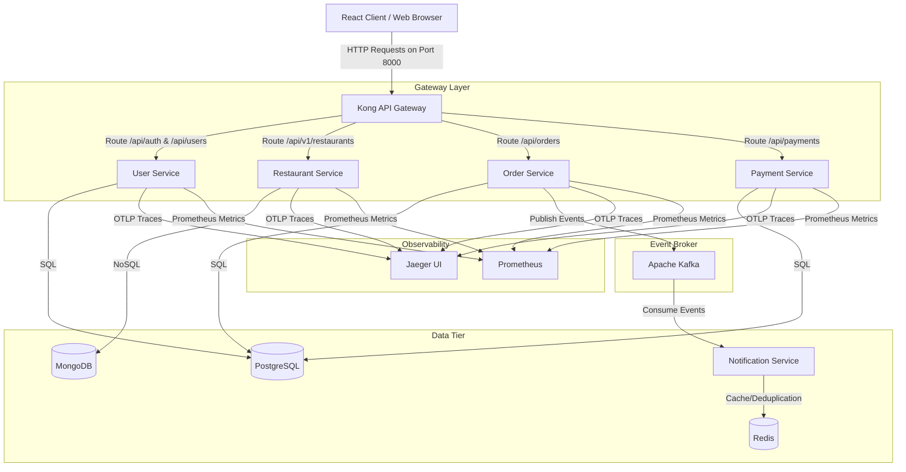
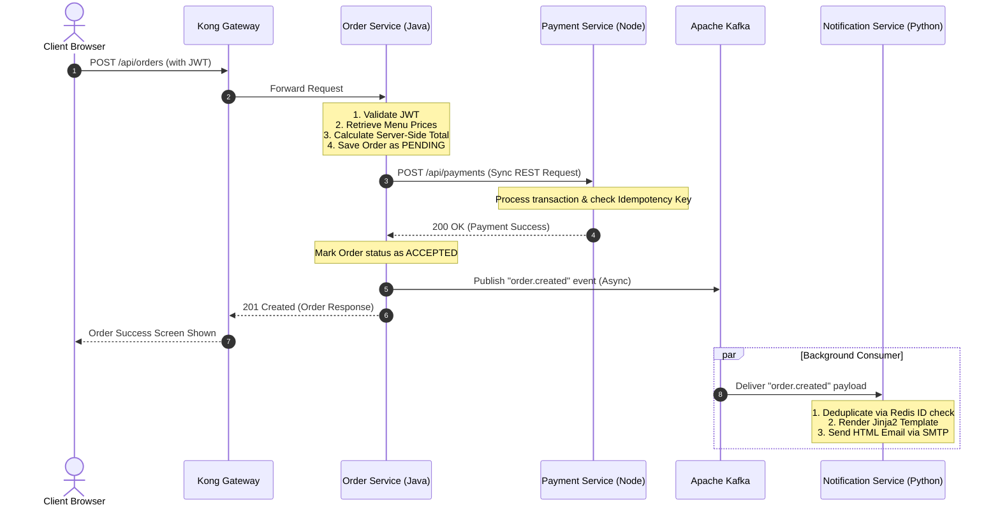

# Khaana Khazana - Microservices Architecture Document

This document outlines the architectural design, service boundaries, event flows, and operational responsibilities of the **Khaana Khazana** food delivery platform.

---

## 1. Architectural Overview & System Topology

Khaana Khazana is implemented as a polyglot microservices platform. It utilizes specialized language runtimes and database engines tailored to each service's specific operational needs. All client requests route through a unified API Gateway.

---

## 2. Service Boundaries & Responsibilities

### 2.1 User Service
* **Tech Stack**: Node.js + Express
* **Database**: PostgreSQL (relational storage for profile stability)
* **Responsibilities**:
  * User registration and password hashing using `bcrypt`.
  * Authentication and session management via stateless JSON Web Tokens (JWT).
  * Profile CRUD management (phone numbers, profile metadata).
  * Address book management (CRUD operations for multiple delivery addresses).
  * Exposes token refresh endpoints using long-lived refresh tokens.

### 2.2 Restaurant Service
* **Tech Stack**: Python 3.11+ + FastAPI
* **Database**: MongoDB (NoSQL Document Store)
* **Responsibilities**:
  * High-performance catalog browsing of restaurant profiles and menus.
  * Uses a **denormalized schema** where menus are embedded directly inside restaurant documents to avoid expensive JOIN queries.
  * Implements text search indexing on restaurant `name` and `cuisine` using MongoDB Text Search indexes.
  * Handles menu management (adding, updating, or deleting menu items).

### 2.3 Order Service
* **Tech Stack**: Java 17 + Spring Boot 3.3+
* **Database**: PostgreSQL (relational database to ensure ACID compliance for transaction boundaries)
* **Responsibilities**:
  * Manages the lifecycle and state transitions of order placement.
  * Calculates prices and order totals server-side (preventing client-side price tampering).
  * Enforces state machine transitions (e.g., preventing an order from transitioning directly from `PENDING` to `DELIVERED` without being `ACCEPTED` first).
  * Communicates synchronously with the **Payment Service** during checkout.
  * Publishes transaction events asynchronously to **Apache Kafka**.

### 2.4 Payment Service
* **Tech Stack**: Node.js + Express
* **Database**: PostgreSQL
* **Responsibilities**:
  * Simulates payment capture and processing.
  * Enforces **idempotency checks** using unique transaction keys to prevent double-charging users on network failures.

### 2.5 Notification Service
* **Tech Stack**: Python + FastAPI + Redis
* **Database/Cache**: Redis (used for event message deduplication)
* **Responsibilities**:
  * Consumes events from Apache Kafka in the background.
  * Utilizes Redis to track processed event IDs, ensuring exactly-once processing.
  * Renders HTML email templates using **Jinja2** to include order breakdowns and restaurant details.
  * Dispatches real emails via SMTP.

---

## 3. Communication & Event Flows

The platform leverages two types of communication flows: **Synchronous REST APIs** for transactional operations requiring immediate feedback, and **Asynchronous Event Streams** for background processes.

### 3.1 Order Checkout Flow (Sync & Async Collaboration)

The diagram below represents what happens when a user places an order:

### 3.2 Resiliency (Circuit Breakers)
The **Order Service** coordinates with the **Payment Service** synchronously. If the Payment Service goes offline:
* A **Resilience4j Circuit Breaker** intercepts the failure.
* A fallback mechanism saves the order in the database with `paymentCompleted = false`.
* It raises an `order.created.payment_pending` event to Kafka so that the client and notification systems are aware of the outstanding payment status.

---

## 4. Cross-Cutting Concerns

### 4.1 API Gateway (Kong)
Kong serves as the client entrypoint:
* **Routing**: Maps public-facing paths to downstream microservices (e.g., `/api/auth` -> `user-service:5000`).
* **Rate Limiting**: Limits requests per IP to `100 requests/minute` to mitigate Denial of Service (DoS) attacks.
* **Security**: Decodes JWT headers and blocks unauthenticated requests before they hit the internal network.
* **CORS**: Enforces cross-origin policies to enable seamless browser communication.

### 4.2 Distributed Tracing & Metrics (Observability)
* **OpenTelemetry SDKs**: Instrumented across FastAPI, Express, and Spring Boot.
* **Distributed Tracing**: Generates trace and span IDs per request. When a request flows from `Kong` -> `Order Service` -> `Payment Service`, OpenTelemetry propagates the context. Traces are exported to **Jaeger** (Port `16686`).
* **Metrics**: Microservices expose metric endpoints scraped by **Prometheus** (Port `9090`).
