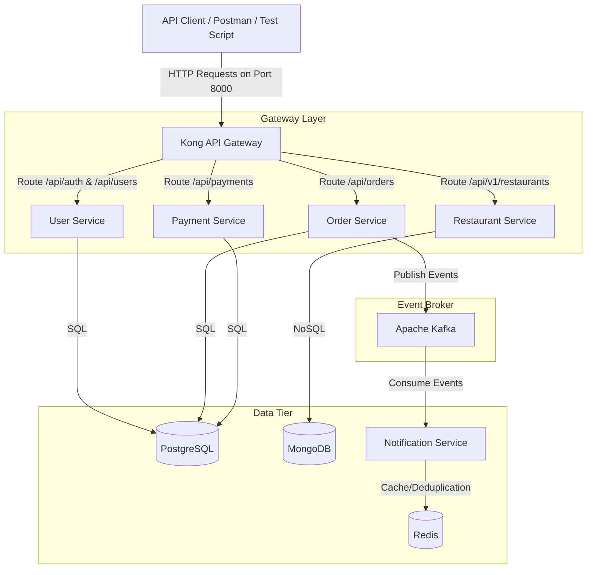

        # Khaana Khazana - Polyglot Microservices Backend

This repository implements the backend microservices platform for **Khaana Khazana**, a food delivery system modeled on services like Swiggy and Zomato. The architecture is designed as a polyglot microservices platform, utilizing different programming languages, framework stacks, and database engines tailored to each service's specific operational requirements.

---

## 👤 Personal Contribution & Portfolio Context

This project was originally developed as a **7-member team capstone project**. This personal repository features the backend system and showcases my individual engineering contributions.

### My Role & Responsibilities:

- **User Service Backend**: Developed the Node.js + Express User Service to handle user profiles, addresses, authentication, and secure JWT/refresh-token generation.
- **Service Integration**: Led the integration of the polyglot microservices, coordinating request-response flows across Node.js, FastAPI, and Spring Boot runtimes.
- **Kong API Gateway Configuration**: Fully integrated Kong (in DB-less mode) on port `8000`, securing endpoints, implementing CORS policies, and configuring global Rate-Limiting rules (100 req/min).
- **Kubernetes Orchestration**: Wrote the cluster deployments, ClusterIP services, ConfigMaps, and Persistent Volume Claims (PVCs) for local Kubernetes deployment, and authored the step-by-step Minikube deployment guide.

### Out of Scope / Outstanding Items:

The following requirements from the original capstone scope were left out of this implementation:

1. **Loki & Grafana Log Aggregation**: Observability is currently implemented via console logs and OpenTelemetry metrics/traces (Jaeger/Prometheus). Loki/Grafana dashboards are not configured.
2. **Pact Contract Testing**: Consumer-driven contract test suites (Pact compatibility validation) are not included.

---

## 1. System Architecture & Tech Stack

The platform consists of five core services, communicating through synchronous REST APIs, a central API Gateway, and an asynchronous event broker (Apache Kafka).



### Services at a Glance

| Service Name             | Responsibility                             | Language / Stack        | Database   | Port (Internal) |
| :----------------------- | :----------------------------------------- | :---------------------- | :--------- | :-------------- |
| **Kong Gateway**         | Routing, CORS, and Rate Limiting           | OpenResty / Lua         | _DB-less_  | `8000`          |
| **User Service**         | Auth, JWT validation, registration         | Node.js + Express       | PostgreSQL | `5000`          |
| **Restaurant Service**   | Menus, restaurant lookup, text search      | Python + FastAPI        | MongoDB    | `8000`          |
| **Order Service**        | Order lifecycle, state machine, validation | Java + Spring Boot      | PostgreSQL | `8080`          |
| **Payment Service**      | Payment simulation, idempotency            | Node.js + Express       | PostgreSQL | `3002`          |
| **Notification Service** | Email/SMS notification dispatch            | Python + Kafka consumer | Redis      | `8002`          |

---

## 2. Key Architecture Features

- **Kong API Gateway (DB-less)**: A single proxy entrypoint on port `8000` that routes paths to backend services, handles CORS, and applies a global Rate-Limiting plugin (100 req/min).
- **Asynchronous Event-Driven Notifications**: The Order Service publishes `order.created` events to Apache Kafka. The Notification Service consumes these events asynchronously, rendering email templates in the background.
- **Resiliency**: The Order Service communicates synchronously with the Payment Service using a **Resilience4j Circuit Breaker** with a fallback mechanism to handle payment system downtime gracefully.
- **Exactly-Once Processing**: The Notification Service uses **Redis** to cache processed event IDs to prevent duplicate email dispatches.
- **Observability**: Services are instrumented with **OpenTelemetry**, exporting distributed traces to **Jaeger** and metrics to **Prometheus**.

---

## 3. Local Development (Docker Compose)

To spin up all databases, brokers, and backend microservices locally in one command, run:

```bash
docker compose up --build -d
```

---

## 4. Kubernetes Deployment (Minikube)

All deployment manifests (Deployments, Services, ConfigMaps, and PVCs) are located in the `kubernetes/` folder.

To deploy the backend to Minikube:

1. Start your cluster: `minikube start --driver=docker`
2. Follow the detailed steps in [KUBERNETES_DEPLOYMENT.md](./kubernetes/KUBERNETES_DEPLOYMENT.md) to build the local images and deploy the manifests.
3. Expose the gateway:
   ```bash
   kubectl port-forward service/kong 8000:8000
   ```

---

## 5. Testing the APIs

An automated E2E testing script is included at the root of the repository to verify that all microservices communicate correctly through the Kong Gateway (on Port 8000):

```bash
node test_apis.js
```

This script tests the entire transaction flow: **User Registration -> Restaurant Retrieval -> Order Creation -> Synchronous Payment processing -> Asynchronous Notification trigger**.
