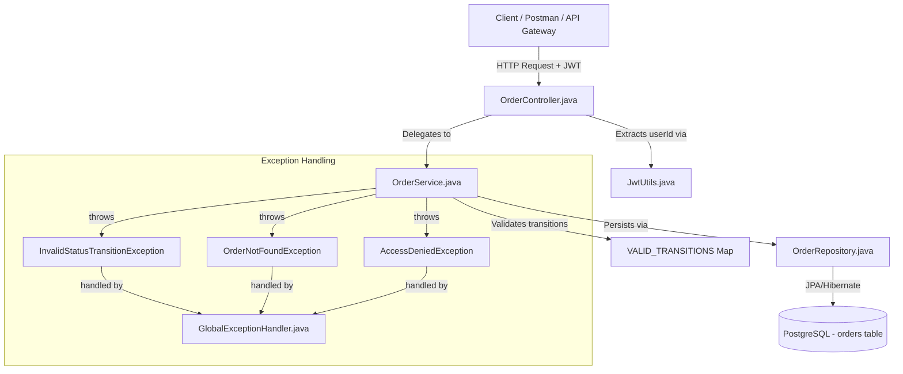

# Order Service

Order lifecycle management service for Khaana-Khazana.

By: Anuran Pradhan — 2341016360 and Aditi Choudhury — 2341003044


## Responsibilities

- Place a new order (with items, restaurant, delivery address, payment mode)
- Calculate order total server-side (price × quantity per item)
- Enforce JWT-based authentication (userId extracted from token — never from request body)
- Ownership enforcement (a user can only fetch their own orders)
- Order status lifecycle management with strict transition rules
- Expose order history per user

---

# Order Service Documentation — Khaana Khazana

## 1. Architecture Overview

The Order Service is built with a clean layered architecture following Spring Boot MVC conventions:



---

## 2. Technology Stack

| Layer | Technology |
|:---|:---|
| **Language** | Java 17 |
| **Framework** | Spring Boot 3.3.5 |
| **Database** | PostgreSQL 13+ |
| **ORM** | Spring Data JPA / Hibernate |
| **JWT Parsing** | JJWT 0.9.1 |
| **Validation** | Jakarta Bean Validation (`spring-boot-starter-validation`) |
| **API Docs** | SpringDoc OpenAPI (Swagger UI) |
| **Build Tool** | Maven (Maven Wrapper included) |
| **Boilerplate** | Lombok |

---

## 3. Setup & Installation Guide

### Prerequisites

- Java 17+ installed
- PostgreSQL 13+ running locally on port `5432`
- No separate Maven installation needed — use the included `mvnw` wrapper

### Step 1: Configure the Database

Ensure a database named `ecommerce` exists in your PostgreSQL server. If it doesn't, run:

```sql
CREATE DATABASE ecommerce;
```

### Step 2: Configure Environment (application.properties)

Edit `src/main/resources/application.properties`:

```properties
spring.application.name=Order-Service

spring.datasource.url=jdbc:postgresql://localhost:5432/ecommerce
spring.datasource.username=${YOUR_USERNAME}
spring.datasource.password=${YOUR_PASSWORD}
spring.datasource.driver-class-name=org.postgresql.Driver

spring.jpa.hibernate.ddl-auto=update
spring.jpa.database-platform=org.hibernate.dialect.PostgreSQLDialect
spring.jpa.show-sql=true
spring.jpa.properties.hibernate.format_sql=true

# Must match the secret used by the User Service when signing tokens
jwt.secret=${YOUR_SECRET_KEY}
```

> ⚠️ **Important:** Replace `${YOUR_USERNAME}`, `${YOUR_PASSWORD}`, and `${YOUR_SECRET_KEY}` with your actual PostgreSQL credentials and JWT secret. `jwt.secret` must match the `JWT_SECRET` value used by the User Service.

### Step 3: Run the Application

```bash
# Windows
.\mvnw.cmd spring-boot:run

# Mac / Linux
./mvnw spring-boot:run
```

The server starts on **`http://localhost:8080`**

### Step 4: Run Unit Tests

```bash
# Windows
.\mvnw.cmd test

# Mac / Linux
./mvnw test
```

---

## 4. Database Schema

The schema is auto-generated by Hibernate (`ddl-auto=update`).

### Table: `orders`

| Column | Type | Constraints | Description |
|:---|:---|:---|:---|
| `id` | BIGINT | PRIMARY KEY, AUTO_INCREMENT | Unique order ID |
| `customer_name` | VARCHAR | NOT NULL | Name of the customer |
| `status` | VARCHAR | NOT NULL | Current lifecycle status (PENDING, ACCEPTED, …) |
| `user_id` | BIGINT | NOT NULL | Extracted from JWT — never from request body |
| `restaurant_id` | BIGINT | NOT NULL | ID of the restaurant |
| `restaurant_name` | VARCHAR | NOT NULL | Denormalized restaurant name |
| `total_amount` | DECIMAL(10,2) | NOT NULL | Calculated server-side (Σ price × quantity) |
| `payment_mode` | VARCHAR | — | CASH, UPI, CARD |
| `payment_completed` | BOOLEAN | NOT NULL, Default: false | Payment gate flag |
| `delivery_address` | VARCHAR | NOT NULL | Delivery destination |
| `created_at` | DATETIME | NOT NULL, immutable | Set by `@PrePersist` |
| `updated_at` | DATETIME | NOT NULL | Updated by `@PreUpdate` |

### Table: `order_items` (embedded collection)

| Column | Type | Constraints | Description |
|:---|:---|:---|:---|
| `order_id` | BIGINT | FK → orders.id | Parent order |
| `item_name` | VARCHAR | NOT NULL | Name of the menu item |
| `quantity` | INT | NOT NULL, > 0 | Number of units |
| `price` | DECIMAL | NOT NULL, > 0 | Price per unit |

---

## 5. Order Status Lifecycle & Transition Rules

Every order starts as `PENDING` (set automatically via `@PrePersist`).

```
PENDING ──► ACCEPTED ──► OUT_FOR_DELIVERY ──► DELIVERED
   │              │
   └──────────────┴──► CANCELLED
```

| From | Allowed To |
|:---|:---|
| `PENDING` | `ACCEPTED`, `CANCELLED` |
| `ACCEPTED` | `OUT_FOR_DELIVERY`, `CANCELLED` |
| `OUT_FOR_DELIVERY` | `DELIVERED` |
| `DELIVERED` | ❌ Terminal — no further transitions |
| `CANCELLED` | ❌ Terminal — no further transitions |

Any illegal move (e.g. `PENDING → DELIVERED`) throws `InvalidStatusTransitionException` → **HTTP 400**.

---

## 6. JWT Authentication Contract

Every protected endpoint requires an `Authorization` header:

```
Authorization: Bearer <token>
```

### What happens server-side

1. `JwtUtils.extractUserId(authHeader)` strips the `Bearer ` prefix
2. Parses the JWT using the shared `jwt.secret`
3. Reads the `sub` claim (subject) — which is the `userId` as a string
4. Returns it as `Long` to the controller

### JWT Payload expected from User Service

```json
{
  "sub": "42",
  "iat": 1716884000,
  "exp": 1716884900
}
```

> **Rule:** `userId` is **never** accepted in the request body. It is always and only extracted from the JWT.

---

## 7. API Reference

Base URL: `http://localhost:8080/api/orders`

Swagger UI: `http://localhost:8080/swagger-ui/index.html`

---

### 1. Create Order

- **Endpoint**: `POST /api/orders`
- **Access**: Private (JWT required)
- **Headers**: `Authorization: Bearer <token>`
- **Request Body**:
  ```json
  {
    "customerName": "Anurag Nair",
    "restaurantId": 1,
    "restaurantName": "Biryani House",
    "items": [
      { "itemName": "Chicken Biryani", "quantity": 2, "price": 250.00 },
      { "itemName": "Raita",           "quantity": 1, "price":  50.00 }
    ],
    "paymentMode": "UPI",
    "deliveryAddress": "42 MG Road, Pune"
  }
  ```
  > `userId` and `totalAmount` are **NOT** accepted — they are set by the server.
- **Success Response (201 Created)**:
  ```json
    "id": 1,
    "customerName": "Anurag Nair",
    "userId": "42",
    "restaurantId": "10",
    "restaurantName": "Biryani House",
    "items": [
      { "itemName": "Chicken Biryani", "quantity": 2, "price": 250.00 },
      { "itemName": "Raita",           "quantity": 1, "price":  50.00 }
    ],
    "totalAmount": 550.00,
    "paymentMode": "UPI",
    "paymentCompleted": true,
    "deliveryAddress": "42 MG Road, Pune",
    "status": "PENDING",
    "createdAt": "2026-06-26T21:00:00",
    "updatedAt": "2026-06-26T21:00:00"
  }
  ```

> **Note on Integrations:**
> - **Payment Service (Sync):** The Order Service calls the Payment Service synchronously when an order is created. This call is wrapped with a **Resilience4j Circuit Breaker**. If the Payment Service is down, the fallback method triggers, the order is still saved but `paymentCompleted` remains `false`, and an `order.created.payment_pending` event is sent.
> - **Notification Service (Async):** The Order Service publishes an `order.created` JSON event to the Kafka `notification_topic` for the Notification Service to consume. The payload is serialized using Jackson's `ObjectMapper` and includes the full order details, notably the `restaurantName` and the `items` array, enabling the Notification Service to generate detailed, itemized HTML emails.


---

### 2. Get My Orders

- **Endpoint**: `GET /api/orders/my`
- **Access**: Private (JWT required)
- **Headers**: `Authorization: Bearer <token>`
- **Description**: Returns all orders placed by the authenticated user. `userId` is extracted from the JWT — not from the URL.
- **Success Response (200 OK)**:
  ```json
  [
    {
      "id": 1,
      "customerName": "Anurag Nair",
      "status": "PENDING",
      "totalAmount": 550.00,
      ...
    }
  ]
  ```

---

### 3. Get Order By ID

- **Endpoint**: `GET /api/orders/{id}`
- **Access**: Private (JWT required, ownership enforced)
- **Headers**: `Authorization: Bearer <token>`
- **Success Response (200 OK)**: Full `OrderResponse` object (same shape as Create Order response)
- **Error Response (403 Forbidden)**:
  ```json
  {
    "timestamp": "2026-06-26T21:05:00",
    "status": 403,
    "error": "Forbidden",
    "message": "You don't own this order"
  }
  ```
- **Error Response (404 Not Found)**:
  ```json
  {
    "timestamp": "2026-06-26T21:05:00",
    "status": 404,
    "error": "Not Found",
    "message": "Order not found with id: 99"
  }
  ```

---

### 4. Update Order Status

- **Endpoint**: `PUT /api/orders/{id}/status`
- **Access**: Public (intended for internal service calls / admin)
- **Request Body**:
  ```json
  { "status": "ACCEPTED" }
  ```
  Valid values: `ACCEPTED`, `OUT_FOR_DELIVERY`, `DELIVERED`, `CANCELLED`
- **Success Response (200 OK)**: Updated `OrderResponse`
- **Error Response (400 Bad Request)** — illegal transition:
  ```json
  {
    "timestamp": "2026-06-26T21:06:00",
    "status": 400,
    "error": "Bad Request",
    "message": "Invalid status transition from PENDING to DELIVERED"
  }
  ```

---

### 5. Get All Orders (Admin)

- **Endpoint**: `GET /api/orders`
- **Access**: Public (no auth required — intended for admin/internal use)
- **Success Response (200 OK)**: Array of all `OrderResponse` objects

---

## 8. Error Response Reference

All errors follow a consistent JSON structure:

```json
{
  "timestamp": "2026-06-26T21:00:00",
  "status": 400,
  "error": "Bad Request",
  "message": "Human-readable error message"
}
```

| HTTP Status | Exception | When |
|:---|:---|:---|
| `400` | `InvalidStatusTransitionException` | Illegal order status move |
| `400` | `IllegalArgumentException` | Unknown status string (e.g. `"SHIPPED"`) |
| `400` | `MethodArgumentNotValidException` | Bean validation failure (`@Valid`) |
| `403` | `AccessDeniedException` | User tries to fetch another user's order |
| `404` | `OrderNotFoundException` | Order ID does not exist |

---

## 9. Project Structure

```
order-service/
├── src/main/java/com/ecommerce/project/
│   ├── controller/
│   │   └── OrderController.java         # REST endpoints
│   ├── service/
│   │   └── OrderService.java            # Business logic, transition rules
│   ├── model/
│   │   ├── Order.java                   # JPA entity
│   │   ├── OrderItem.java               # Embeddable item
│   │   ├── OrderStatus.java             # Enum: PENDING, ACCEPTED, …
│   │   └── PaymentMode.java             # Enum: CASH, UPI, CARD
│   ├── payload/
│   │   ├── CreateOrderRequest.java      # Inbound DTO (no userId, no totalAmount)
│   │   ├── OrderResponse.java           # Outbound DTO
│   │   └── UpdateStatusRequest.java     # Status transition DTO
│   ├── repositories/
│   │   └── OrderRepository.java         # JPA repository + findByUserId
│   ├── security/
│   │   └── JwtUtils.java               # JWT parsing — extracts userId from Bearer token
│   └── exceptions/
│       ├── AccessDeniedException.java
│       ├── InvalidStatusTransitionException.java
│       ├── OrderNotFoundException.java
│       └── GlobalExceptionHandler.java  # @RestControllerAdvice
└── src/test/java/com/ecommerce/project/
    └── service/
        └── OrderServiceTest.java        # 20 unit tests (JUnit 5 + Mockito)
```

---

## 10. Verification & Testing

### Run Unit Tests

```bash
.\mvnw.cmd test         # Windows
./mvnw test             # Mac / Linux
```

The test suite (`OrderServiceTest.java`) covers **20 scenarios**:

| Category | Tests |
|:---|:---|
| Create Order | Creates with PENDING status, calculates total (single item), calculates total (multi-item) |
| Valid Transitions | PENDING→ACCEPTED, ACCEPTED→OUT_FOR_DELIVERY, OUT_FOR_DELIVERY→DELIVERED, PENDING→CANCELLED, ACCEPTED→CANCELLED |
| Invalid Transitions | PENDING→DELIVERED, PENDING→OUT_FOR_DELIVERY, ACCEPTED→PENDING, ACCEPTED→DELIVERED, OUT_FOR_DELIVERY→PENDING, OUT_FOR_DELIVERY→ACCEPTED, OUT_FOR_DELIVERY→CANCELLED, DELIVERED→PENDING, DELIVERED→ACCEPTED, DELIVERED→OUT_FOR_DELIVERY, DELIVERED→CANCELLED, CANCELLED→PENDING, CANCELLED→ACCEPTED |
| Not Found | `transitionStatus` throws 404, `getOrderById` throws 404 |
| Ownership | `getOrderById` throws 403 when userId doesn't match |

### Generate a Test JWT (jwt.io)

1. Go to [https://jwt.io](https://jwt.io)
2. Algorithm: `HS256`
3. Payload: `{ "sub": "42" }`
4. Secret: use the value you set for `${YOUR_SECRET_KEY}` in `application.properties`
5. Copy the token and use it as: `Authorization: Bearer <token>`
