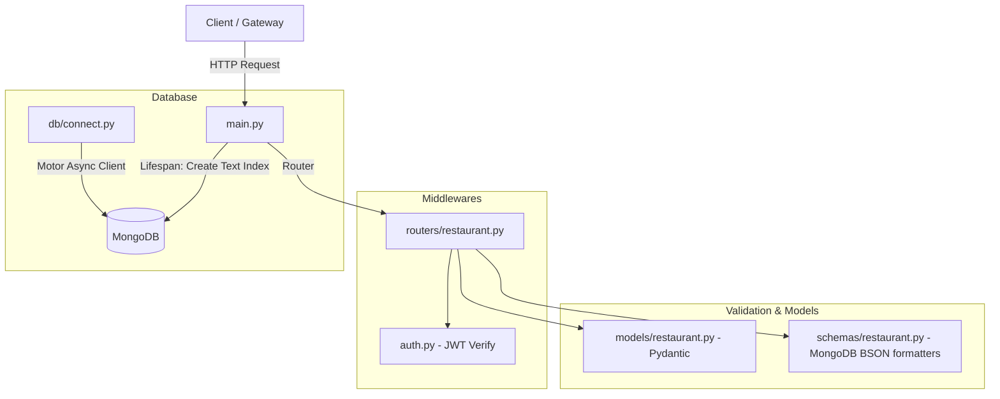

# Restaurant Service - Khaana Khazana

Welcome to the **Restaurant Service** for the Khaana Khazana food delivery platform. This microservice is responsible for managing restaurant profiles, menu directories, menu items, search/filtering indexing, and integrating access controls with the **User Service** using JSON Web Tokens (JWT).

---

## 1. Architecture Overview

This service is built using **FastAPI** (Python) and **MongoDB** (using the asynchronous driver **Motor**). It uses a clean, flat architecture:



---

## 2. Directory Structure

```text
restaurant-service/
├── .env.example              # Template configuration for environment variables
├── .env                      # Active local secrets and configurations (git-ignored)
├── Dockerfile                # Docker image builder instructions
├── .dockerignore             # Files ignored in docker builds
├── requirements.txt          # Python dependency packages list
├── main.py                   # Application entrypoint & FastAPI setup
├── auth.py                   # JWT extraction and validation middleware
├── config.py                 # Environment configuration loader
├── README.md                 # Service documentation
├── openapi.json              # Auto-generated OpenAPI spec file
├── export_openapi.py         # Utility script to export OpenAPI specs
├── db/
│   ├── __init__.py
│   └── connect.py            # Motor Async MongoClient connection manager
├── models/
│   ├── __init__.py
│   └── restaurant.py         # Pydantic Schemas (Restaurant, MenuItem, Updates)
├── routers/
│   ├── __init__.py
│   └── restaurant.py         # FastAPI route handlers & controller logic
└── schemas/
    ├── __init__.py
    └── restaurant.py         # Formatter functions (BSON/Pydantic dict mapping)
```

---

## 3. Technology Stack

* **Language**: Python 3.11+
* **Web Framework**: FastAPI (Asynchronous ASGI framework)
* **Database**: MongoDB (NoSQL Document Store)
* **Async DB Driver**: Motor (Async wrapper for PyMongo)
* **Data Validation**: Pydantic v2
* **Token Decoding**: PyJWT (JWT validation library)
* **Web Server**: Uvicorn (ASGI web server)
* **Monitoring**: Prometheus FastAPI Instrumentator

---

## 4. Setup & Installation Guide

### Prerequisites
* Python 3.11+ installed.
* MongoDB server running locally (default: `mongodb://localhost:27017`) or via Docker.

### Step 1: Configure Environment Variables
Create a `.env` file in the root of `backend/restaurant-service/`:
```env
MONGODB_URL=mongodb://localhost:27017
DATABASE_NAME=restaurant_db

# MUST match the JWT_SECRET in your User Service configuration
JWT_SECRET=superSecretAccessKey2026!
```

### Step 2: Install Dependencies
Run the installation script:
```bash
pip install -r requirements.txt
```

### Step 3: Start the Server
Start the development server using Uvicorn:
```bash
uvicorn main:app --port 8001 --reload
```
* **Note**: The service runs on port **8001** (as mapped by Kong/Docker).

### Step 4: Verify the Swagger UI Docs
FastAPI auto-generates Swagger documentation. Once running, go to:
* **Interactive docs**: `http://localhost:8001/docs`

---

## 5. Database Schema (MongoDB Collections)

This service uses MongoDB for high-throughput reads on menus. It implements a **denormalized schema** where menu items are embedded directly inside the restaurant document to avoid expensive join queries.

### Collection: `restaurants`
```json
{
  "_id": "60c72b2f9b1d8b2f9c8b4567", // MongoDB ObjectId
  "name": "Tiffin Express",
  "city": "Pune",
  "cuisine": "North Indian",
  "rating": 4.5,
  "is_active": true,
  "menu": [
    {
      "itemId": "a1b2c3d4-e5f6-7a8b-9c0d-1e2f3a4b5c6d", // UUID v4
      "restaurant_id": "60c72b2f9b1d8b2f9c8b4567",
      "name": "Paneer Butter Masala",
      "price": 249.00,
      "category": "MAIN_COURSE",
      "available": true
    }
  ]
}
```

### Indexing
On startup, `main.py` triggers a lifespan hook that automatically creates a **Text Search Index** on the `name` and `cuisine` fields in MongoDB:
```python
await db["restaurants"].create_index([("name", pymongo.TEXT), ("cuisine", pymongo.TEXT)])
```

---

## 6. JWT Security Contract

All endpoints (except `/health`) are secured by the JWT dependency. 

### Middleware Validation Flow
1. Intercepts the HTTP request and reads the header: `Authorization: Bearer <token>`
2. Calls `jwt.decode(token, JWT_SECRET, algorithms=["HS256"])`.
3. If the token is valid, it decodes the payload:
   ```json
   {
     "userId": "uuid-string",
     "email": "user@example.com",
     "iat": 1716884000,
     "exp": 1716884900
   }
   ```
4. Stores the payload and allows the request to pass. If verification fails (e.g. token expired, invalid signature), it returns `401 Unauthorized` directly.

---

## 7. API Reference

All requests must contain `Authorization: Bearer <token>` in the HTTP headers.

### Restaurant Management

#### 1. Get All Restaurants
* **GET** `/api/v1/restaurants`
* **Response (200 OK)**:
  ```json
  [
    {
      "id": "60c72b2f9b1d8b2f9c8b4567",
      "name": "Tiffin Express",
      "city": "Pune",
      "cuisine": "North Indian",
      "rating": 4.5,
      "is_active": true,
      "menu": [...]
    }
  ]
  ```

#### 2. Get Restaurant by ID
* **GET** `/api/v1/restaurants/{id}`
* **Response (200 OK)**: Returns the single restaurant profile.

#### 3. Create Restaurant
* **POST** `/api/v1/restaurants`
* **Request Body**:
  ```json
  {
    "name": "Burger Junction",
    "city": "Pune",
    "cuisine": "American",
    "rating": 4.2,
    "is_active": true
  }
  ```

#### 4. Update Restaurant
* **PUT** `/api/v1/restaurants/{id}`
* **Request Body**: (Allows updating individual fields: `name`, `city`, `cuisine`, `rating`, `is_active`)

#### 5. Delete Restaurant
* **DELETE** `/api/v1/restaurants/{id}`

---

### Menu Management

#### 6. Get Restaurant Menu (Order Service Contract)
* **GET** `/api/v1/restaurants/{id}/menu`
* **Response (200 OK)**: Returns list of active menu items formatted to match the Order Service contract requirements:
  ```json
  [
    {
      "itemId": "a1b2c3d4-e5f6-7a8b-9c0d-1e2f3a4b5c6d",
      "name": "Paneer Butter Masala",
      "price": 249.00,
      "available": true
    }
  ]
  ```

#### 7. Add Menu Item
* **POST** `/api/v1/restaurants/{id}/menu`
* **Request Body**:
  ```json
  {
    "name": "Mango Lassi",
    "price": 99.00,
    "category": "BEVERAGE",
    "available": true
  }
  ```

#### 8. Update Menu Item
* **PUT** `/api/v1/restaurants/{id}/menu/{itemId}`
* **Request Body**: (Allows updating `name`, `price`, `category`, `available`)

#### 9. Delete Menu Item
* **DELETE** `/api/v1/restaurants/{id}/menu/{itemId}`

---

### Search / Filter

#### 10. Search Restaurants
* **GET** `/api/v1/search`
* **Query Parameters**:
  * `cuisine` (string, optional)
  * `city` (string, optional)
  * `min_rating` (float, optional)
* **Example**: `/api/v1/search?city=Pune&cuisine=Indian&min_rating=4.0`
