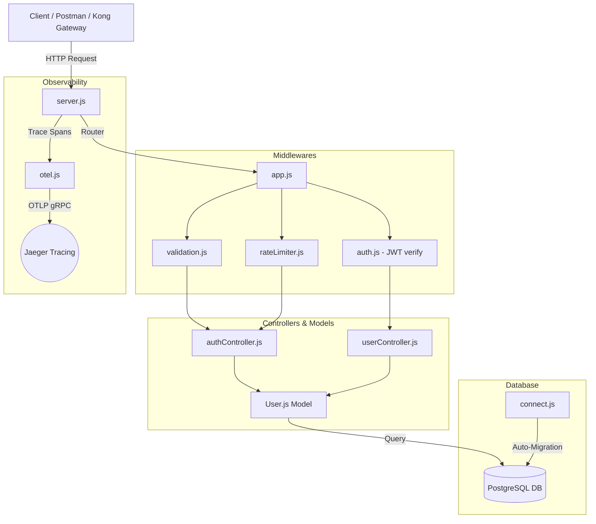

# User Service

Authentication and user management service for Khaana-Khazana.

By: Meenakshi Bhattacharya 2341002174

## Responsibilities

- User Registration
- User Login
- JWT Token Generation
- JWT Verification
- User Profile Management

# User Service Documentation - Khaana Khazana

## 1. Architecture Overview

The User Service is built with a clean separation of concerns following MVC/layering principles:



---

## 2. Technology Stack

- **Runtime**: Node.js
- **Framework**: Express (v4+)
- **Database**: PostgreSQL (v13+)
- **Driver**: `pg` (PostgreSQL client pool)
- **Encryption**: `bcrypt` (12 salt rounds)
- **Tokens**: `jsonwebtoken` (JWT)
- **Validation**: `express-validator`
- **Rate Limiting**: `express-rate-limit`
- **Observability**: OpenTelemetry SDK (`@opentelemetry/sdk-node`)

---

## 3. Setup & Installation Guide

### Prerequisites

- Node.js installed (v18+ recommended).
- PostgreSQL database instance running locally or via Docker.
- A database tool like pgAdmin, DBeaver, or psql.

### Step 1: Initialize Database

Ensure a database exists in your PostgreSQL server called `khaana_khazana`. If it doesn't, execute:

```sql
CREATE DATABASE khaana_khazana;
```

### Step 2: Configure Environment Variables

Create a `.env` file in the root of the project:

```env
PORT=5000
NODE_ENV=development

# Database Configuration
DB_USER=postgres
DB_PASSWORD=Meenakshib0210   # Your database password
DB_HOST=localhost
DB_PORT=5432
DB_NAME=khaana_khazana

# Secrets for token signing
JWT_SECRET=superSecretAccessKey2026!
JWT_REFRESH_SECRET=superSecretRefreshKey2026!

# OpenTelemetry configuration (optional)
OTEL_EXPORTER_OTLP_ENDPOINT=http://localhost:4317
```

### Step 3: Install Dependencies

Run the installation command in your terminal:

```bash
npm install
```

### Step 4: Run the Application

For development mode (with auto-reload on changes):

```bash
npm run dev
```

For production mode:

```bash
npm start
```

---

## 4. Database Schema & Auto-Migrations

The service automatically initializes its own schema on startup (in `src/db/connect.js`). It creates the following table:

### Table: `users`

| Column Name     | Data Type    | Constraints                               | Description                             |
| :-------------- | :----------- | :---------------------------------------- | :-------------------------------------- |
| `id`            | UUID         | PRIMARY KEY, Default: `gen_random_uuid()` | Unique identifier for each user         |
| `email`         | VARCHAR(255) | UNIQUE, NOT NULL                          | User's email address (login identifier) |
| `password_hash` | VARCHAR(255) | NOT NULL                                  | Salted bcrypt hash of the password      |
| `name`          | VARCHAR(255) | NOT NULL                                  | User's full name                        |
| `created_at`    | TIMESTAMPTZ  | Default: `CURRENT_TIMESTAMP`              | Date and time the account was created   |

---

## 5. JWT Payload Schema & Security Contract

The authentication utilizes JSON Web Tokens (JWT) for stateless session handling.

### Access Token Payload Schema

When signed during login or refresh, the JWT payload contains the following properties:

```json
{
  "userId": "3c5d6e24-9b2f-4882-84bb-7319ea6d814c",
  "email": "meenakshi@example.com",
  "iat": 1716884000,
  "exp": 1716884900
}
```

- **`userId`** _(UUID)_: The user's database ID.
- **`email`** _(string)_: The user's email address.
- **`iat`** _(integer)_: Issued At timestamp (Unix epoch time, automatically added).
- **`exp`** _(integer)_: Expiration timestamp (Unix epoch time, 15 minutes after issuance).

### How Token Verification Works

Downstream services (Order, Restaurant, Payment) authenticate incoming requests by inspecting the `Authorization` header:

1. Extract the header: `Authorization: Bearer <token>`
2. Verify the signature against the shared secret (`JWT_SECRET`).
3. Decode the payload to read `userId` and `email` to verify ownership.

---

## 6. API Reference Documentation

All endpoints return JSON responses.

### 1. Register User

- **Endpoint**: `/api/auth/register`
- **Method**: `POST`
- **Access**: Public
- **Request Body**:
  ```json
  {
    "email": "user@example.com",
    "password": "securePassword123",
    "name": "Meenakshi"
  }
  ```
- **Success Response (201 Created)**:
  ```json
  {
    "message": "User registered successfully.",
    "user": {
      "id": "3c5d6e24-9b2f-4882-84bb-7319ea6d814c",
      "email": "user@example.com",
      "name": "Meenakshi",
      "createdAt": "2026-06-25T12:00:00.000Z"
    }
  }
  ```
- **Error Response (400 Bad Request)**:
  ```json
  {
    "error": "Email is already registered."
  }
  ```

---

### 2. Login User

- **Endpoint**: `/api/auth/login`
- **Method**: `POST`
- **Access**: Public (Rate Limited to 5 requests per 15 minutes per IP)
- **Request Body**:
  ```json
  {
    "email": "user@example.com",
    "password": "securePassword123"
  }
  ```
- **Success Response (200 OK)**:
  ```json
  {
    "message": "Login successful.",
    "token": "eyJhbGciOiJIUzI1NiIsInR5cCI6IkpXVCJ9...",
    "refreshToken": "eyJhbGciOiJIUzI1NiIsInR5cCI6IkpXVCJ9...",
    "user": {
      "id": "3c5d6e24-9b2f-4882-84bb-7319ea6d814c",
      "email": "user@example.com",
      "name": "Meenakshi"
    }
  }
  ```
- **Error Response (401 Unauthorized)**:
  ```json
  {
    "error": "Invalid email or password."
  }
  ```

---

### 3. Refresh Access Token

- **Endpoint**: `/api/auth/refresh`
- **Method**: `POST`
- **Access**: Public
- **Request Body**:
  ```json
  {
    "refreshToken": "eyJhbGciOiJIUzI1NiIsInR5cCI6IkpXVCJ9..."
  }
  ```
- **Success Response (200 OK)**:
  ```json
  {
    "token": "newAccessJWTTokenStringHere..."
  }
  ```
- **Error Response (401 Unauthorized)**:
  ```json
  {
    "error": "Refresh token has expired. Please log in again."
  }
  ```

---

### 4. Verify Access Token

- **Endpoint**: `/api/auth/verify`
- **Method**: `GET`
- **Access**: Private (Requires Bearer token in header)
- **Headers**: `Authorization: Bearer <token>`
- **Success Response (200 OK)**:
  ```json
  {
    "valid": true,
    "user": {
      "userId": "3c5d6e24-9b2f-4882-84bb-7319ea6d814c",
      "email": "user@example.com",
      "iat": 1716884000,
      "exp": 1716884900
    }
  }
  ```

---

### 5. Fetch User Profile

- **Endpoint**: `/api/users/me`
- **Method**: `GET`
- **Access**: Private (Requires Bearer token in header)
- **Headers**: `Authorization: Bearer <token>`
- **Success Response (200 OK)**:
  ```json
  {
    "id": "3c5d6e24-9b2f-4882-84bb-7319ea6d814c",
    "email": "user@example.com",
    "name": "Meenakshi",
    "createdAt": "2026-06-25T12:00:00.000Z"
  }
  ```

---

### 6. Health Check

- **Endpoint**: `/health`
- **Method**: `GET`
- **Access**: Public
- **Success Response (200 OK)**:
  ```json
  {
    "status": "ok",
    "database": "connected",
    "uptime": "120.45s",
    "timestamp": "2026-06-25T13:30:00.000Z"
  }
  ```

---

## 7. Verification & Testing

### Automated Test Script

We have included a test suite in `test-api.js`. To run it:

1. Ensure your server is running (`npm run dev`).
2. Run: `node test-api.js`
3. It will perform registration, login, profile fetch, verify token, and refresh token cycles and print a summary.
